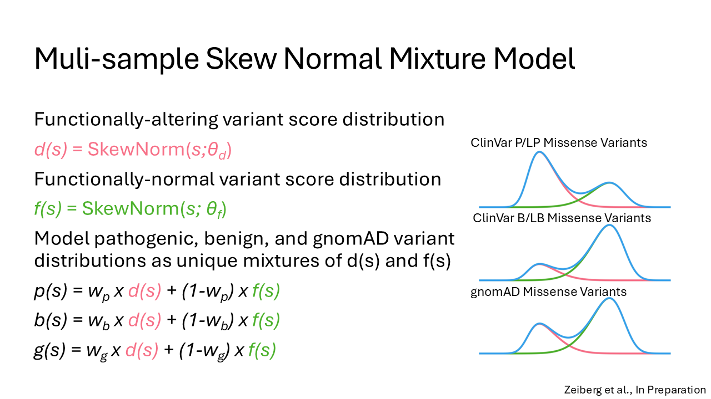

# MAVE Calibration
> Software to calibrate multiplex assays of variant effect (MAVE) data as a line of evidence for clinical variant classification

## Method Overview
Given assay scores for control variants (e.g. ClinVar P/LP and B/LB) along with those for variants from the target population (e.g. gnomAD), model the assay score distributions of ClinVar P/LP, ClinVar B/LB and gnomAD and obtain a mapping from assay score to strength of evidence in classifying a variant's pathogenicity/benignity.



## Usage
```python
from mave_calibration.main import singleFit
from mave_calibration.plotting.generate_aggregate_figs import get_lrPlus, prior_from_weights,get_score_thresholds

# observations, sample_indicators, sample_names = load_data()

modelFit = singleFit(observations, sample_indicators)
score_range = list(range(observations.min(), observations.max(), .01))
lrPlus = get_lrPlus(score_range, sample_names.index('B/LB'), modelFit)
prior = prior_from_weights(modelFit.get("weights"),
                                controls_idx=sample_names.index('B/LB'))
pathogenic_score_thresholds, benign_score_thresholds = get_score_thresholds(lrPlus, prior, score_range)
```
### See [examples/example.py](examples/example.py)
